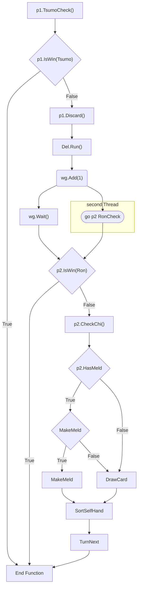

```mermaid
graph TB
A["p1.TsumoCheck()"]-->B
B{"p1.IsWin(Tsumo)"}-->|True| End
B-->|False| C
C["p1.Discard()"] -->D
D["Del.Run()"] -->E
E("wg.Add(1)")-->WT
E-->ET
WT["wg.Wait()"]-->F
subgraph second Thread
ET(["go p2 RonCheck"])
end
ET-->F
F{"p2.IsWin(Ron)"} -->|True| End
F-->|False| G
G["p2.CheckChi()"] -->H
H{"p2.HasMeld"} -->|True| MeldChoice
H-->|False| DrawCard
MeldChoice{"MakeMeld"} -->|True| MakeMeld
MakeMeld[MakeMeld]-->SortSelfHand
MeldChoice -->|False| DrawCard
DrawCard -->SortSelfHand
SortSelfHand -->TurnNext
TurnNext -->End
End["End Function"]

```