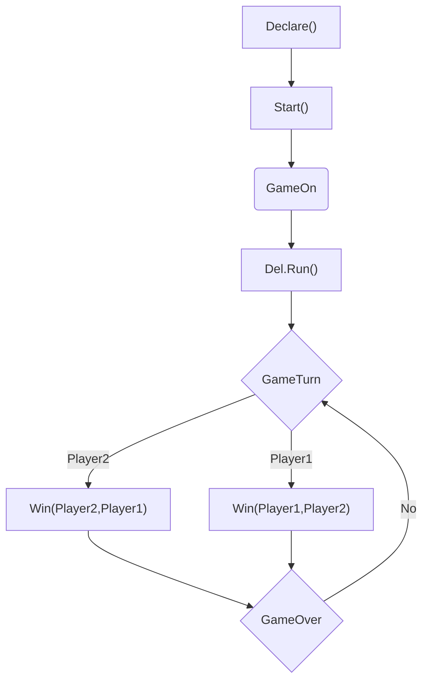

```mermaid
graph 
  A["Declare()"]-->B
  B["Start()"] -->C
  C("GameOn") -->D
D["Del.Run()"]-->E
E{GameTurn} -->|Player1| P1["Win(Player1,Player2)"]
E-->|Player2| P2["Win(Player2,Player1)"]
F
P2-->F
P1-->F
F{GameOver}-->|No|E
```